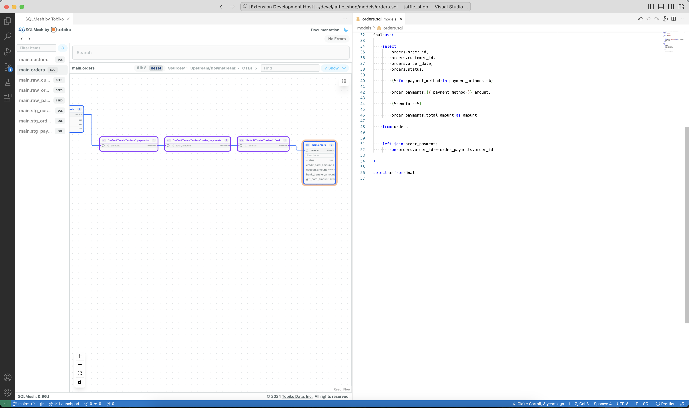

<h1 align="center">
SQLMesh UI
</h1>

Embedded SQLMesh UI in VS Code

</h1>

> Heavily inspired by [Browse Lite](https://github.com/antfu/vscode-browse-lite) from [antfu](https://github.com/antfu)

- 🌗 Dark mode (provided by SQLMesh UI itself)
- 🤸 Opens as editor tab, giving flexibility to be repositioned as you please
- 🖥 Shortcut to open in the system browser
- ✅ No Telemetry

## 🚦 Requirements

1. [Python extension](https://marketplace.visualstudio.com/items?itemName=ms-python.python) enabled
2. SQLMesh set up in a virtual environment, as described in [Installation guide](https://sqlmesh.readthedocs.io/en/stable/installation/).

## Demo

<figure>
	<picture>
    
	</picture>
</figure>

## How to Use

1. Run `sqlmesh ui --mode=docs` in the background

2. Run `SQLMesh UI: Open SQLMesh UI`

## Screenshots

<figure align=center>
	<picture>
		<source srcset="./resources/wide-dark.png" media="(prefers-color-scheme: dark)">
    
	</picture>
	
<em>Tabs split horizontally</em>

</figure>

<figure>
	<picture>
		<source srcset="./resources/dark.png" media="(prefers-color-scheme: dark)">
    
	</picture>
	
<em>Tabs split vertically</em>

</figure>

## 🧑‍💻 Contributing

Feel free to dive in! 🔥

Just please [start an Issue](https://github.com/WesleyBatista/vscode-sqlmeshui/issues) before working on a PR 🙏

## 🌟 Support My Work

If you find this extension useful, please consider supporting me on [Ko-fi](https://ko-fi.com/wesleybatista/), by becoming a [Github Sponsor](https://github.com/sponsors/WesleyBatista) or through [PayPal](https://paypal.me/wesleybatistas).

Your contributions will help keep this project alive and fund future updates.
